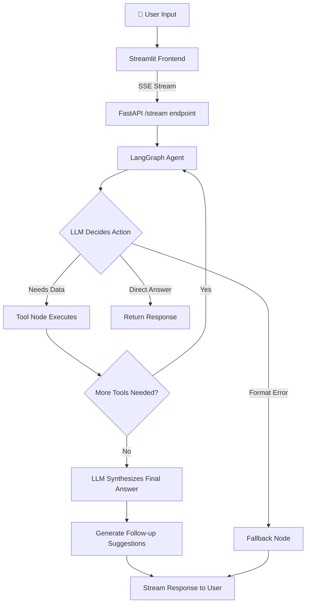

<p align="center">
  <h1 align="center">📊 FBOT — AI-Powered Financial Assistant</h1>
  <p align="center">
    <strong>An intelligent chatbot for Indian stock market analysis, built with LangGraph, FastAPI, and Streamlit</strong>
  </p>
  <p align="center">
    
    
    
    
    
    
  </p>
</p>

---

## 📋 Table of Contents

- [Overview](#-overview)
- [Key Features](#-key-features)
- [Tech Stack](#-tech-stack)
- [Architecture](#-architecture)
- [Project Structure](#-project-structure)
- [Chatbot Flow](#-chatbot-flow)
- [Agent Tools](#-agent-tools)
- [API Endpoints](#-api-endpoints)
- [Data Sources](#-data-sources)
- [Setup & Installation](#-setup--installation)
- [Environment Variables](#-environment-variables)
- [Running the Project](#-running-the-project)
- [Deployment](#-deployment)
- [Configuration](#-configuration)

---

## 🔍 Overview

**FBOT** is a production-grade AI financial assistant chatbot that provides real-time Indian stock market data, technical & fundamental analysis, financial news with sentiment analysis, stock screening, and trading education — all through a conversational interface.

It uses a **LangGraph ReAct agent** architecture where an LLM autonomously selects and chains tools to answer complex financial queries. The system supports both REST API and real-time WebSocket/SSE streaming.

---

## ✨ Key Features

| Feature | Description |
|---|---|
| 💰 **Real-Time Stock Prices** | Live prices for any NSE/BSE stock via yfinance |
| 📊 **Market Overview** | NIFTY 50, SENSEX, Bank NIFTY levels at a glance |
| 🔬 **Full Stock Analysis** | Technical (RSI, MACD, Bollinger, Supertrend, ADX, VWAP) + Fundamental (PE, PB, ROE, Debt/Equity from Screener.in) |
| 📰 **Smart News** | LLM-enriched financial news with sentiment analysis (bullish/bearish/neutral) and relevance filtering |
| 🔍 **Stock Screener** | Pre-built screens: undervalued, momentum, oversold, high dividend, strong fundamentals |
| 📈 **Historical Data** | OHLCV history for any stock (1–90 days) |
| 🎓 **Trading Education** | Built-in knowledge base + Wikipedia + Tavily web search for financial concept explanations |
| 🧠 **Conversation Memory** | Persistent sessions via async SQLite checkpointing |
| ⚡ **Streaming Responses** | Real-time SSE streaming and WebSocket support |
| 💡 **Smart Suggestions** | LLM-generated follow-up question suggestions via structured output |

---

## 🛠 Tech Stack

### Core AI & Agent Framework

| Technology | Purpose |
|---|---|
| [LangGraph](https://github.com/langchain-ai/langgraph) | StateGraph-based ReAct agent orchestration with conditional edges, fan-out sub-graphs, and tool nodes |
| [LangChain](https://github.com/langchain-ai/langchain) | Tool abstractions, structured output, prompt management |
| [Groq API](https://groq.com/) | Ultra-fast LLM inference (LLaMA 3.3 70B Versatile) |
| [Google Gemini](https://ai.google.dev/) | LLM fallback provider |

### Backend

| Technology | Purpose |
|---|---|
| [FastAPI](https://fastapi.tiangolo.com/) | High-performance async REST API with auto-generated OpenAPI docs |
| [Uvicorn](https://www.uvicorn.org/) | ASGI server |
| [Pydantic](https://docs.pydantic.dev/) | Data validation, settings management, request/response schemas |
| [Pydantic Settings](https://docs.pydantic.dev/latest/concepts/pydantic_settings/) | Environment variable configuration management |
| [SlowAPI](https://github.com/laurentS/slowapi) | Dynamic, config-driven rate limiting |
| [Sentry SDK](https://sentry.io/) | Error monitoring and performance tracing |

### Frontend

| Technology | Purpose |
|---|---|
| [Streamlit](https://streamlit.io/) | Premium dark-themed chat interface with real-time SSE streaming |

### Market Data & Financial Services

| Technology | Purpose |
|---|---|
| [yfinance](https://github.com/ranaroussi/yfinance) | Real-time stock prices, historical OHLCV data, company info (NSE/BSE/US markets) |
| [Screener.in API](https://www.screener.in/) | 10-year fundamental data for Indian stocks (PE, PB, ROE, ROCE, shareholding) — no API key required |
| [pandas-ta](https://github.com/twopirllc/pandas-ta) | Extended technical indicators: Supertrend, ADX, Stochastic Oscillator, VWAP |
| [pandas](https://pandas.pydata.org/) / [numpy](https://numpy.org/) | Core technical indicator calculations (RSI, MACD, SMA, EMA, Bollinger Bands) |

### Knowledge & Search

| Technology | Purpose |
|---|---|
| [FAISS](https://github.com/facebookresearch/faiss) | Vector store for RAG retrieval over trading knowledge base |
| [Sentence Transformers](https://www.sbert.net/) (`all-MiniLM-L6-v2`) | Embedding model for semantic search |
| [HuggingFace](https://huggingface.co/) | Embeddings integration via `langchain-huggingface` |
| [Wikipedia API](https://pypi.org/project/Wikipedia-API/) | Financial concept explanations and company background |
| [Tavily Search](https://tavily.com/) | Real-time web search for up-to-date financial context |

### News

| Technology | Purpose |
|---|---|
| [feedparser](https://github.com/kurtmckee/feedparser) | RSS feed parsing (Google News India) |
| [aiohttp](https://docs.aiohttp.org/) | Async HTTP client for news fetching |

### Data & Caching

| Technology | Purpose |
|---|---|
| [SQLite](https://www.sqlite.org/) (via `aiosqlite`) | Async persistent conversation memory (LangGraph checkpointer) |
| [cachetools](https://github.com/tkem/cachetools) | In-memory TTL caching for market data, news, and fundamentals |
| [rapidfuzz](https://github.com/maxbachmann/RapidFuzz) | Fuzzy string matching for company name typo recovery |

### Testing

| Technology | Purpose |
|---|---|
| [pytest](https://pytest.org/) + [pytest-asyncio](https://github.com/pytest-dev/pytest-asyncio) | Async test suite |
| [httpx](https://www.python-httpx.org/) | Async HTTP client for integration tests |

### Deployment

| Technology | Purpose |
|---|---|
| [Railway](https://railway.app/) | Cloud deployment with Nixpacks builder |
| Procfile | Heroku-compatible process declaration |

---

## 🏗 Architecture

```
┌─────────────────────────────────────────────────────────────────┐
│                      STREAMLIT FRONTEND                        │
│         Premium dark-themed chat UI (streamlit_app.py)          │
│    ┌──────────┐  ┌──────────┐  ┌───────────┐  ┌────────────┐  │
│    │ Chat Box │  │ Sidebar  │  │Quick      │  │ Suggestion │  │
│    │          │  │ Actions  │  │Chips      │  │ Buttons    │  │
│    └──────────┘  └──────────┘  └───────────┘  └────────────┘  │
└────────────────────────┬────────────────────────────────────────┘
                         │ SSE Streaming / REST / WebSocket
                         ▼
┌─────────────────────────────────────────────────────────────────┐
│                     FASTAPI BACKEND (main.py)                   │
│  ┌──────────┐  ┌──────────┐  ┌───────────┐  ┌──────────────┐  │
│  │ /chat    │  │ /stream  │  │ /ws/chat  │  │ /market/*    │  │
│  │ (REST)   │  │ (SSE)    │  │(WebSocket)│  │ /news, etc.  │  │
│  └──────────┘  └──────────┘  └───────────┘  └──────────────┘  │
│         Rate Limiting (SlowAPI)  │  CORS  │  Sentry           │
└────────────────────────┬────────────────────────────────────────┘
                         │
                         ▼
┌─────────────────────────────────────────────────────────────────┐
│              LANGGRAPH REACT AGENT (chatbot/agent.py)           │
│                                                                 │
│  ┌─────────┐    ┌──────────────┐    ┌───────────┐              │
│  │  START  │───▶│  Agent Node  │───▶│  Route    │              │
│  └─────────┘    │  (LLM Call)  │    │ Decision  │              │
│                 └──────────────┘    └─────┬─────┘              │
│                        ▲                  │                     │
│                        │         ┌────────┼────────┐           │
│                        │         ▼        ▼        ▼           │
│                 ┌──────────┐ ┌───────┐ ┌────────┐ ┌─────┐     │
│                 │Tool Node │ │Tools  │ │Fallback│ │ END │     │
│                 │(executes)│ │(loop) │ │ Node   │ │     │     │
│                 └──────────┘ └───────┘ └────────┘ └─────┘     │
│                                                                 │
│  Memory: AsyncSqliteSaver (FBOT.db)                        │
│  Model:  Groq LLaMA 3.3 70B Versatile                         │
└────────────────────────┬────────────────────────────────────────┘
                         │
                         ▼
┌─────────────────────────────────────────────────────────────────┐
│                     9 AGENT TOOLS                               │
│                                                                 │
│  ┌──────────────┐ ┌──────────────┐ ┌───────────────────┐       │
│  │get_stock_    │ │get_index_    │ │get_market_        │       │
│  │price         │ │data          │ │summary            │       │
│  └──────────────┘ └──────────────┘ └───────────────────┘       │
│  ┌──────────────┐ ┌──────────────┐ ┌───────────────────┐       │
│  │get_stock_    │ │get_stock_    │ │get_stock_         │       │
│  │details       │ │history       │ │news               │       │
│  └──────────────┘ └──────────────┘ └───────────────────┘       │
│  ┌──────────────┐ ┌──────────────┐ ┌───────────────────┐       │
│  │search_       │ │screen_       │ │analyze_stock      │       │
│  │knowledge_base│ │stocks        │ │(sub-graph)        │       │
│  └──────────────┘ └──────────────┘ └───────────────────┘       │
└────────────────────────┬────────────────────────────────────────┘
                         │
                         ▼
┌─────────────────────────────────────────────────────────────────┐
│                    DATA SERVICES LAYER                           │
│                                                                 │
│  ┌──────────────┐ ┌──────────────┐ ┌───────────────────┐       │
│  │Market Data   │ │News Service  │ │Screener.in        │       │
│  │(yfinance)    │ │(RSS + LLM)   │ │Service            │       │
│  └──────────────┘ └──────────────┘ └───────────────────┘       │
│  ┌──────────────┐ ┌──────────────┐ ┌───────────────────┐       │
│  │Wikipedia     │ │Tavily Web    │ │Technical          │       │
│  │Service       │ │Search        │ │Indicators Engine  │       │
│  └──────────────┘ └──────────────┘ └───────────────────┘       │
│  ┌──────────────┐ ┌──────────────┐                              │
│  │Symbol        │ │RAG Retriever │                              │
│  │Resolver      │ │(FAISS)       │                              │
│  └──────────────┘ └──────────────┘                              │
└─────────────────────────────────────────────────────────────────┘
```

---

## 📂 Project Structure

```
FBOT/
├── main.py                          # FastAPI application entry point
├── streamlit_app.py                 # Streamlit chat UI frontend
├── requirements.txt                 # Python dependencies
├── .env                             # Environment variables (API keys)
├── Procfile                         # Heroku/Railway process declaration
├── railway.json                     # Railway deployment configuration
├── FBOT.db                      # SQLite DB for conversation memory
│
├── chatbot/                         # 🤖 Core chatbot module
│   ├── __init__.py
│   ├── agent.py                     # LangGraph ReAct agent, all 9 tools, StateGraph
│   ├── rag_chain.py                 # RAG retriever (FAISS), Wikipedia, Tavily search
│   │
│   ├── core/                        # Core utilities
│   │   ├── symbol_registry.py       # Static stock name→ticker mappings, edge-case aliases
│   │   └── symbol_utils.py          # Symbol resolution (Screener.in API + alias + predict)
│   │
│   └── modules/                     # Feature modules
│       ├── market_formatter.py      # Formatting for stock prices, indices, history
│       └── trading_assistant.py     # Built-in trading knowledge base (40+ topics)
│
├── common/                          # 📦 Shared utilities & configuration
│   ├── __init__.py
│   ├── config/
│   │   ├── settings.py              # Pydantic Settings (env vars, feature flags)
│   │   └── prompts.py               # System prompts and persona configuration
│   │
│   ├── models/
│   │   └── schemas.py               # All Pydantic models (20+ schemas)
│   │
│   ├── data_services/
│   │   ├── market_data.py           # yfinance wrapper (price, details, history, indices)
│   │   ├── news_service.py          # RSS news + LLM enrichment (sentiment, filtering)
│   │   ├── screener_in_service.py   # Screener.in fundamental data API
│   │   └── wikipedia_service.py     # Wikipedia API for concept explanations
│   │
│   └── utils/
│       └── cache.py                 # TTL cache utilities
│
├── screener/                        # 🔍 Stock screening engine
│   ├── __init__.py
│   ├── screener.py                  # Pre-built screens + custom screen runner
│   ├── screener_formatter.py        # Rich output formatting for analysis results
│   └── technical_indicators.py      # Full technical analysis engine (12+ indicators)
│
└── .streamlit/
    └── secrets.toml                 # Streamlit secrets configuration
```

---

## 🔄 Chatbot Flow

### High-Level Request Flow



### Detailed Agent Execution Flow

1. **User sends message** via Streamlit → SSE stream to FastAPI `/stream` endpoint
2. **FastAPI** creates/retrieves session, passes to `FBOTAgent.stream_message()`
3. **LangGraph StateGraph** processes through nodes:
   - `START` → **Agent Node**: LLM (Groq LLaMA 3.3 70B) reads system prompt + message history + bound tools
   - **Route Decision** (conditional edge):
     - If LLM emits `tool_calls` → route to **Tool Node**
     - If Groq format error → route to **Fallback Node** (safe error message)
     - Otherwise → route to `END`
   - **Tool Node**: Executes selected tool(s), returns results
   - **Loop back** to Agent Node → LLM synthesizes final answer with tool results
4. **Suggestions**: Structured LLM call generates 2–3 follow-up questions
5. **Response** streamed as SSE events: `token` (LLM chunks), `status` (tool usage), `done` (metadata)

### Stock Analysis Sub-Graph (Fan-Out)

The `analyze_stock` tool uses a **LangGraph sub-graph** with parallel execution:

```
START ──┬── fetch_price ──────────┐
        ├── fetch_fundamentals ───┤── synthesise ── END
        └── fetch_technicals ─────┘
```

Three data-fetching nodes run **concurrently** via `Send()`, then fan-in to a synthesis node that produces the final analysis report.

### Symbol Resolution Strategy

```
User Input ("Tata Motors")
        │
        ▼
1. Edge-Case Alias Lookup  → instant (handles "jio", "hul", etc.)
        │ (miss)
        ▼
2. Screener.in API Search  → reliable, returns exact NSE ticker
        │ (miss)
        ▼
3. Predict Fallback        → clean name → append ".NS"
        │
        ▼
   Resolved: "TATAMOTORS.NS"
```

---

## 🔧 Agent Tools

| # | Tool | Pydantic Schema | Description |
|---|---|---|---|
| 1 | `get_stock_price` | `StockQueryInput` | Real-time stock price (CMP, change, volume) |
| 2 | `get_index_data` | — | Market index data (NIFTY, SENSEX, Bank NIFTY) |
| 3 | `get_market_summary` | — | Full market overview of all major indices |
| 4 | `get_stock_details` | `StockQueryInput` | Company info + fundamentals (concurrent fetch via `asyncio.gather`) |
| 5 | `get_stock_history` | `StockHistoryInput` | Historical OHLCV data (1–90 days) |
| 6 | `get_stock_news` | `NewsQueryInput` | Financial news with LLM sentiment enrichment |
| 7 | `search_knowledge_base` | — | Trading knowledge + RAG + Wikipedia + Tavily web search |
| 8 | `screen_stocks` | `ScreenerInput` | Pre-built stock screens (undervalued, momentum, etc.) |
| 9 | `analyze_stock` | `StockQueryInput` | Full technical + fundamental analysis (sub-graph) |

All tools use `InjectedToolCallId` for error tracing and `ToolException` for graceful error handling.

---

## 🌐 API Endpoints

| Method | Endpoint | Description | Rate Limited |
|---|---|---|---|
| `GET` | `/` | Root health check | ❌ |
| `GET` | `/health` | Health check | ❌ |
| `POST` | `/chat` | Main chat (REST) | ✅ |
| `POST` | `/v2/chat` | V2 chat with full request model | ✅ |
| `POST` | `/stream` | Streaming chat (SSE) | ✅ |
| `WS` | `/ws/chat` | WebSocket real-time chat | ❌ |
| `GET` | `/market/{symbol}` | Direct stock price lookup | ✅ |
| `GET` | `/index/{index_name}` | Direct index data lookup | ✅ |
| `GET` | `/news` | Financial news (optional `?symbol=`) | ✅ |
| `GET` | `/analyze/{symbol}` | Full stock analysis | ✅ |
| `GET` | `/screener/screens` | List available screens | ✅ |
| `GET` | `/screener/{screen_name}` | Run a pre-built screen | ✅ |
| `POST` | `/screener/custom` | Run custom screen with filters | ✅ |

---

## 📡 Data Sources

| Source | Data Provided | Auth Required |
|---|---|---|
| **yfinance** | Stock prices, history, company info, indices | ❌ Free |
| **Screener.in** | PE, PB, ROE, ROCE, D/E, shareholding, pros/cons | ❌ Free |
| **Google News RSS** | Latest financial headlines (India-focused) | ❌ Free |
| **Wikipedia API** | Financial concept explanations, company background | ❌ Free |
| **Tavily Search** | Real-time web search results | ✅ API Key |
| **Groq API** | LLM inference (LLaMA 3.3 70B) | ✅ API Key |

---

## ⚙ Setup & Installation

### Prerequisites

- Python 3.10+
- pip
- Groq API key ([get one free](https://console.groq.com/))
- (Optional) Tavily API key for web search

### Installation

```bash
# 1. Clone the repository
git clone https://github.com/your-username/FBOT.git
cd FBOT

# 2. Create virtual environment
python -m venv venv

# Windows
venv\Scripts\activate
# macOS/Linux
source venv/bin/activate

# 3. Install dependencies
pip install -r requirements.txt

# 4. Configure environment variables
cp .env.example .env
# Edit .env with your API keys
```

---

## 🔑 Environment Variables

Create a `.env` file in the project root:

```env
# Required
GROQ_API_KEY=gsk_your_groq_api_key_here

# Optional — enables web search
TAVILY_API_KEY=tvly-your_tavily_key_here

# Optional — LLM configuration
LLM_MODEL=llama-3.3-70b-versatile
LLM_TEMPERATURE=0.3
LLM_MAX_TOKENS=2048

# Optional — server config
SERVER_HOST=0.0.0.0
SERVER_PORT=8000
RATE_LIMIT_PER_MINUTE=20
RATE_LIMIT_ENABLED=true

# Optional — feature flags
ENABLE_STREAMING=true
ENABLE_WEBSOCKET=true
ENABLE_NEWS=true

# Optional — monitoring
SENTRY_DSN=your_sentry_dsn_here

# Optional — Gemini fallback
GEMINI_API_KEY=your_gemini_key_here
```

---

## 🚀 Running the Project

### 1. Start the Backend (FastAPI)

```bash
# Development (with auto-reload)
uvicorn main:app --reload --host 0.0.0.0 --port 8000

# Production
python main.py
```

The API will be available at `http://localhost:8000` with interactive docs at `/docs`.

### 2. Start the Frontend (Streamlit)

In a **separate terminal**:

```bash
streamlit run streamlit_app.py
```

The UI will open at `http://localhost:8501`.

### 3. Quick Test

```bash
# Test health endpoint
curl http://localhost:8000/health

# Test chat
curl -X POST http://localhost:8000/chat \
  -H "Content-Type: application/json" \
  -d '{"message": "What is the price of Reliance?"}'
```

---

## 🚢 Deployment

### Railway

The project includes `railway.json` for one-click Railway deployment:

```json
{
  "build": {"builder": "NIXPACKS"},
  "deploy": {
    "startCommand": "uvicorn main:app --host 0.0.0.0 --port $PORT",
    "restartPolicyType": "ON_FAILURE"
  }
}
```

Set environment variables in the Railway dashboard, then deploy.

### Heroku

A `Procfile` is included:

```
web: uvicorn main:app --host 0.0.0.0 --port $PORT
```

---

## ⚙ Configuration

All configuration is centralized in `common/config/settings.py` using **Pydantic Settings**:

| Category | Settings |
|---|---|
| **API Keys** | `groq_api_key`, `tavily_api_key`, `gemini_api_key`, `news_api_key` |
| **LLM** | `llm_model`, `llm_temperature`, `llm_max_tokens`, `llm_model_fallback` |
| **Embedding** | `embedding_model` (default: `all-MiniLM-L6-v2`) |
| **Cache TTLs** | Market data: 30s, News: 5min, Session: 1hr |
| **Rate Limiting** | `rate_limit_per_minute` (default: 20), `rate_limit_enabled` |
| **Feature Flags** | `enable_streaming`, `enable_websocket`, `enable_news`, `enable_portfolio` |
| **Market** | `default_market` (NSE/BSE/US) |
| **RAG** | `rag_chunk_size` (500), `rag_chunk_overlap` (50), `rag_top_k` (3) |

---

## 📊 Technical Indicators Supported

The analysis engine calculates **12+ technical indicators**:

| Indicator | Type | Signal Logic |
|---|---|---|
| **RSI** (14-period) | Momentum | <30 = BUY, >70 = SELL |
| **SMA** (20, 50, 200) | Trend | Price > SMA = BUY |
| **EMA** (12, 26) | Trend | Price > EMA = BUY |
| **MACD** | Momentum | Histogram crossover signals |
| **Bollinger Bands** | Volatility | <10% position = BUY, >90% = SELL |
| **Volume Analysis** | Volume | Ratio vs 20-day average |
| **Supertrend** (7, 3) | Trend | Direction-based signal |
| **ADX** (14) | Trend Strength | >25 = Strong Trend |
| **Stochastic** | Momentum | <20 = BUY, >80 = SELL |
| **VWAP** | Price Level | Price vs VWAP position |
| **Composite Score** | Aggregate | 0–100 (>70 = Bullish, <30 = Bearish) |
| **Composite Signal** | Aggregate | BUY/SELL/HOLD (≥60% consensus) |

---

## 📄 License

This project is for educational and personal use. Stock data is sourced from public APIs. Always consult a SEBI-registered financial advisor before making investment decisions.

---

<p align="center">
  Built with ❤️ using LangGraph, FastAPI, and Streamlit
</p>
